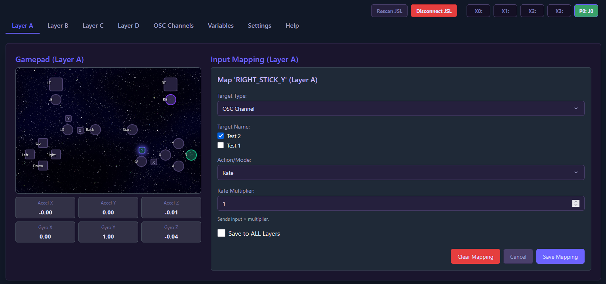
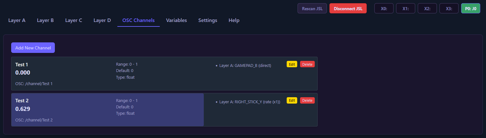
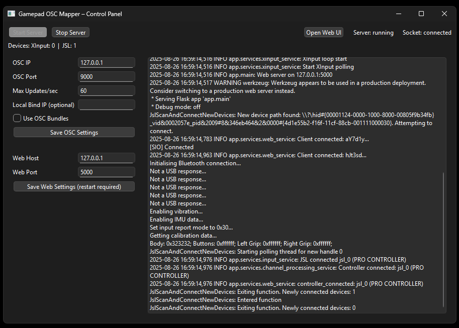
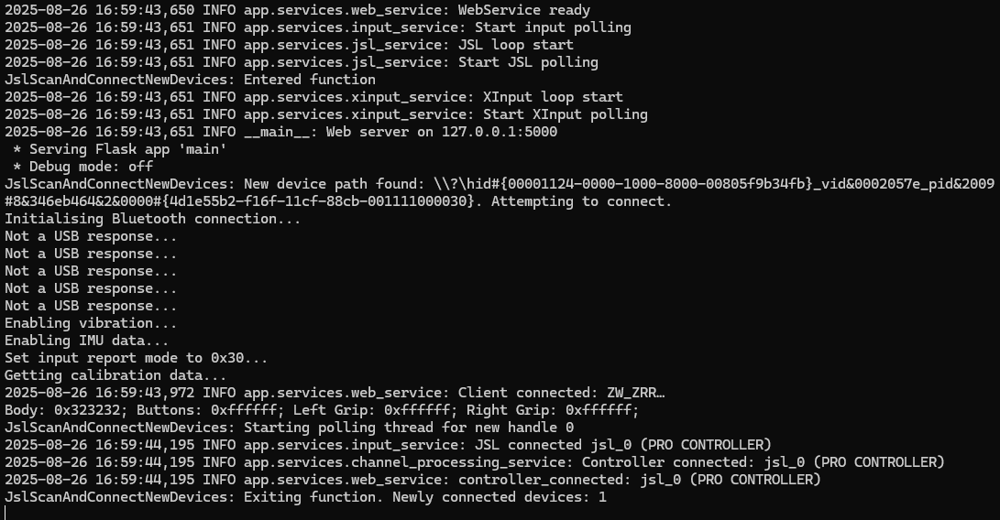

Gamepad OSC Mapper
===================
Turn any gamepad into an OSC (Open Sound Control) controller. Map buttons, sticks, triggers, IMU to OSC, and configure everything in a web interface.

Run it your way
- GUI (desktop): `GamepadOSCMapper-GUI.exe` — native control panel with Start/Stop Server, live status, and quick access to Web/OSC settings.
- CLI (server only): `GamepadOSCMapper-CLI-OneFile.exe` — lightweight one‑file server.

Quick start
1) Download from Releases and place the EXE(s) in a writable folder (creates `configs/` next to the EXE).
2) GUI: run `GamepadOSCMapper-GUI.exe`, click Start Server, then “Open Web UI”.
   CLI: run `GamepadOSCMapper-CLI-OneFile.exe` and open `http://127.0.0.1:5000`.
3) Settings → OSC Server: set target IP/port (your app’s OSC listener), then Save.
4) OSC Channels: add channels (address, type, range/default).
5) Input Mapping: pick Layer A, select an input, choose action (direct/rate/toggle/step/reset) and channel(s). Move the control to test.

Concept & features
- Map buttons, sticks, triggers, IMU (for JSL devices) to OSC.
- Actions: direct, rate, toggle, step, reset, set from input; multi‑target per input.
- Supports variables used in OSC addresses and messages.
- Portable config (`configs/active_config.json`) saved next to the EXE.

Screenshots

Build (developers)
- Install deps: `python -m pip install -r requirements.txt`
- Build both GUI and CLI one‑file: `pyinstaller --clean --noconfirm main.spec`
- Artifacts: `dist/GamepadOSCMapper-GUI.exe`, `dist/GamepadOSCMapper-CLI-OneFile.exe`

Notes
- The GUI bundles Qt; size is larger by design. The CLI one‑file is trimmed and small.
- The web UI is reachable on your LAN (configure host/port in Web settings).

License
MIT — see `LICENSE`.

Acknowledgements
python‑osc, Flask, Flask‑SocketIO, JoyShockLibrary, XInput‑Python